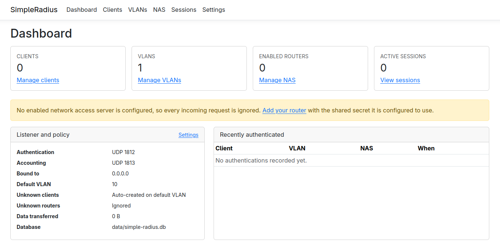
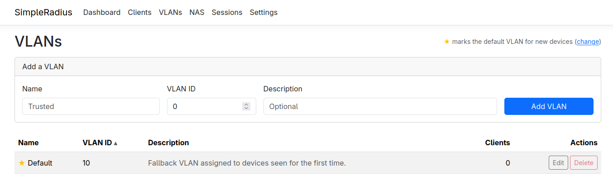
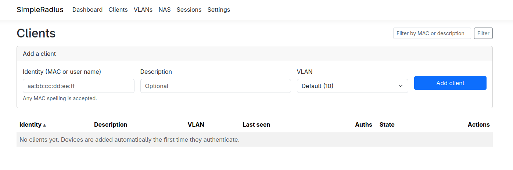
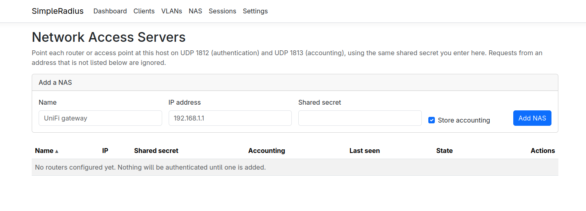
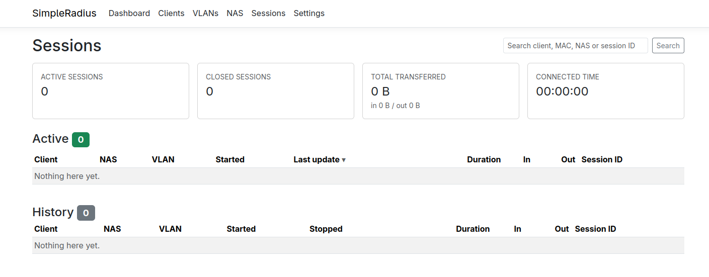
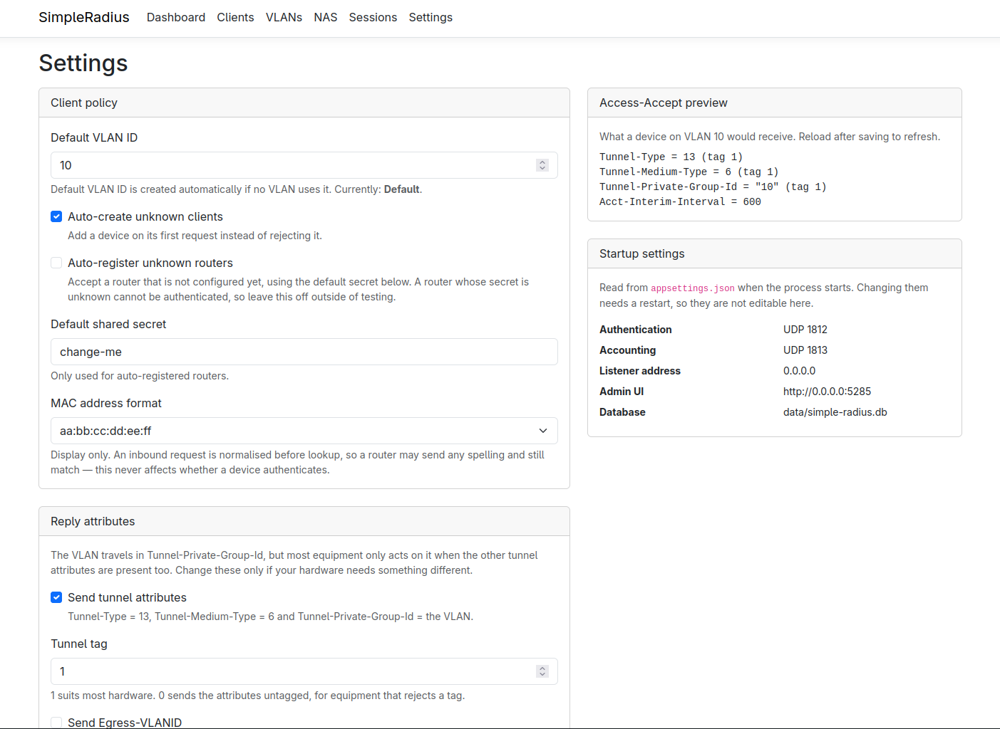

# SimpleRadius

**A small RADIUS server that puts devices on the right VLAN.**

[](https://github.com/XtremeOwnage/SimpleRadius/actions/workflows/ci.yml)
[](LICENSE)
[](https://dotnet.microsoft.com/)

Point your router or access point at it, connect a device, and the device lands on a VLAN. Unknown
devices go to a default VLAN automatically and appear in the admin UI, where you move them to where they
belong. It keeps accounting sessions, and the whole thing is one process and one SQLite file.



> [!WARNING]
> **The admin UI ships with no authentication.** Anyone who can reach it can change VLAN assignments and
> read shared secrets. Run it on a trusted network, or turn on [OpenID Connect](docs/authentication.md).
> Please read [SECURITY.md](SECURITY.md) before exposing it to anything.

## What it is for

Dynamically assigning VLANs to clients. A device authenticates by its MAC address, and SimpleRadius
replies with the VLAN the switch or access point should place it on:

- **Segregate IoT from trusted devices** without hand-maintaining a VLAN table on every access point.
- **Onboard new devices safely** — anything unrecognised lands on a default (quarantine) VLAN until you
  move it.
- **See what is connected**, for how long, and how much it transferred.

It is built for MAC-based authentication, which is what UniFi, MikroTik and similar gear use for dynamic
VLAN assignment. It does **not** do 802.1X with EAP, passwords or certificates.

## Quick start

```bash
docker run -d --name simpleradius \
  -p 8080:8080 -p 1812:1812/udp -p 1813:1813/udp \
  -v simpleradius-data:/data \
  ghcr.io/xtremeownage/simpleradius:latest
```

Open <http://localhost:8080>, add your router under **NAS** with its IP and shared secret, then point the
router at this host on UDP 1812/1813. That is the whole setup.

Other ways to install — binaries, deb/rpm, systemd, Kubernetes, from source — are in
**[docs/deployment.md](docs/deployment.md)**.

## How it works

**Authentication.** An Access-Request is matched to a configured NAS by source address. When it carries a
Message-Authenticator (RFC 3579) the attribute is verified, which is how the shared secret gets checked; a
mismatch is discarded silently, as the RFC requires. The identity comes from User-Name, falling back to
Calling-Station-Id, and is normalised — `AABBCCDDEEFF`, `aa-bb-cc-dd-ee-ff` and `AA:BB:CC:DD:EE:FF` all
resolve to the same client, so firmware differences never cause a mismatch.

**VLAN assignment.** The Access-Accept carries the RFC 2868 tunnel group: Tunnel-Type = 13,
Tunnel-Medium-Type = 6 and Tunnel-Private-Group-Id = the VLAN as ASCII, sharing one tag. The VLAN itself
rides in Tunnel-Private-Group-Id, but the other two must be present for equipment to act on it. Hardware
that wants something different is covered by settings for the tag, Egress-VLANID and Service-Type.

**Accounting.** Accounting-Request authenticators are keyed digests, so the shared secret is verified on
every packet. Sessions open on Start, refresh on interim updates (including the gigawords counters used
when a 32-bit octet counter wraps) and close on Stop. A restarted router's Accounting-On closes whatever
it left open.

Full protocol details: **[docs/how-it-works.md](docs/how-it-works.md)**.

## The admin UI

| | |
| --- | --- |
| **VLANs** — the ★ marks the default for new devices | **Clients** — auto-created devices are tagged |
|  |  |
| **NAS** — routers allowed to talk to the server | **Sessions** — live and historical, with totals |
|  |  |

**Settings** holds client policy and the reply attributes, and previews the exact Access-Accept your
choices produce:



Every table sorts by clicking a heading, and Sessions searches across client, MAC, NAS and session id
(separators ignored, so `aabbcc` and `AA:BB:CC` both match).

## Documentation

| Guide | What is in it |
| --- | --- |
| [Deployment](docs/deployment.md) | Docker, Compose, Kubernetes, systemd, deb/rpm, from source |
| [Configuration](docs/configuration.md) | Every setting, and which need a restart |
| [Authentication](docs/authentication.md) | Turning on OpenID Connect, with worked examples |
| [Logging](docs/logging.md) | Levels, file logs, journald, container logs |
| [How it works](docs/how-it-works.md) | Protocol details and hardware compatibility |
| [Security](SECURITY.md) | The threat model, honestly stated |
| [Contributing](CONTRIBUTING.md) | Building, testing, and the versioning scheme |
| [Changelog](CHANGELOG.md) | What changed, per release |

## Requirements

- Nothing, if you use the container or a self-contained release binary
- .NET 10 SDK to build from source

## Status and limits

Young project. Working and tested, but be aware:

- **No admin authentication by default.** See the warning above.
- **MAC-based authentication only.** No EAP, no 802.1X with certificates, no passwords.
- **One writer.** SQLite means a single instance; do not scale it to multiple replicas.
- **No schema migrations yet.** The database is created with `EnsureCreated`, so a release that changes
  the schema needs a fresh database. This is the first thing on the list to fix.
- Shared secrets are stored in plaintext, because RADIUS needs the original value to compute digests.

## License

MIT — see [LICENSE](LICENSE).
